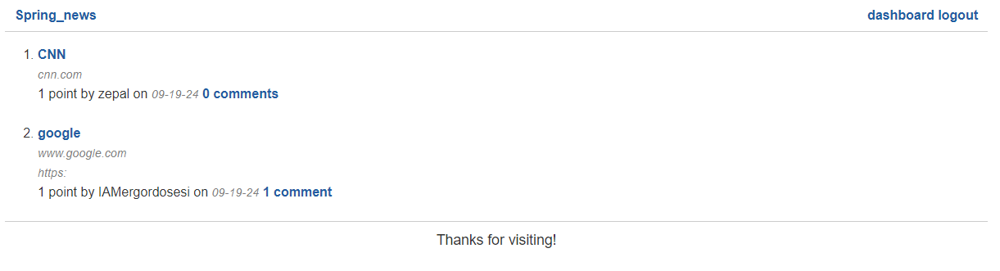

# Spring-news-hub-API

## Description 

The Spring News Hub API is a Java web application designed for tech news enthusiasts, built with Spring Boot and leveraging PostgreSQL for data management. It utilizes Spring Data JPA for database access, Spring Web for RESTful services, Spring Session for session management, and Thymeleaf for dynamic front-end rendering. Users can create accounts, log in, and manage their posts by submitting titles and URLs, allowing others to upvote and comment on submissions. Although the project is basic, it serves as a valuable tool for understanding Spring APIs and their functionalities.

## Instalation

To set up the application, clone the repository, ensure PostgreSQL is installed and running, configure the application properties for the database connection, and then build and run the application using Maven.

## Usage

To use this application, create an account and make a post in the "Create Post" section of the dashboard. You can edit or delete your posts in the post list on the dashboard and view all posts on the homepage by clicking the "Spring News" button. Users can leave upvotes or comments on different posts by clicking the comments link to the right of each post.

## Screenshot displaying the working app

## Credits

N/A

## License

MIT License

Copyright (c) 2024 fabricioGuac

Permission is hereby granted, free of charge, to any person obtaining a copy
of this software and associated documentation files (the "Software"), to deal
in the Software without restriction, including without limitation the rights
to use, copy, modify, merge, publish, distribute, sublicense, and/or sell
copies of the Software, and to permit persons to whom the Software is
furnished to do so, subject to the following conditions:

The above copyright notice and this permission notice shall be included in all
copies or substantial portions of the Software.

THE SOFTWARE IS PROVIDED "AS IS", WITHOUT WARRANTY OF ANY KIND, EXPRESS OR
IMPLIED, INCLUDING BUT NOT LIMITED TO THE WARRANTIES OF MERCHANTABILITY,
FITNESS FOR A PARTICULAR PURPOSE AND NONINFRINGEMENT. IN NO EVENT SHALL THE
AUTHORS OR COPYRIGHT HOLDERS BE LIABLE FOR ANY CLAIM, DAMAGES OR OTHER
LIABILITY, WHETHER IN AN ACTION OF CONTRACT, TORT OR OTHERWISE, ARISING FROM,
OUT OF OR IN CONNECTION WITH THE SOFTWARE OR THE USE OR OTHER DEALINGS IN THE
SOFTWARE.

## Questions

If you have any questions or need help with the project, feel free to contact me through the following channels: - Connect with me on GitHub at [fabricioGuac](https://github.com/fabricioGuac)  - Drop me an email at [guacutofabricio@gmail.com](https://github.com/guacutofabricio@gmail.com)   Don't hesitate to reach out if you need any clarifications or want to share feedback. I'm here to assist you!